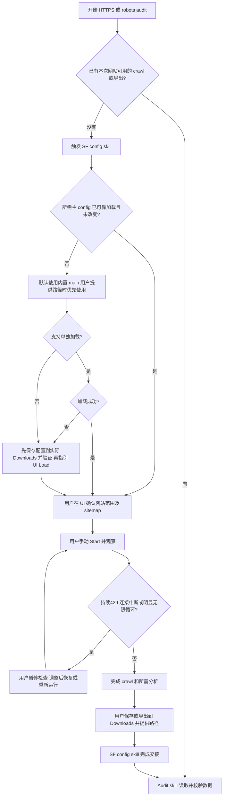
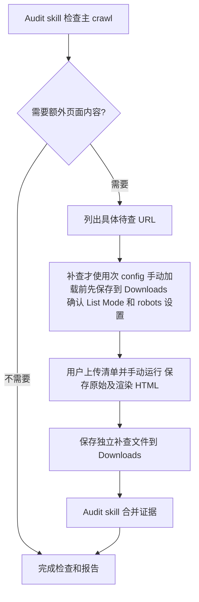

# SF Shared Config

独立的 `sf-shared-config` skill，作为 HTTPS、robots.txt 及其他 onsite audit 的共用准备步骤。已有适用 crawl／导出就跳过；缺少证据时加载预设配置，引导用户在 SF UI 确认 sitemap、手动运行、保存文件到 Downloads，然后交回 audit skill。

本仓库不自动启动 crawl、不判断网站是否通过、不生成审计 Excel。首次整站准备默认选择内置 **main**，不让用户选择主／次，也不要求重复提供能自动解析的路径。只有需要内容补查时才使用次配置。用户可提供路径覆盖默认；覆盖路径无效时不能静默退回内置配置。

## 主流程

已有用户正在运行的 crawl 时，不覆盖配置、不重复启动；保留下一步并在用户完成后继续。孤立的 404、410、重定向是待审计证据，不是每次重新 crawl 的理由。没有有效 sitemap 时记录实际情况和发现限制，不把整个 audit 一律挡住。

## 必要时的补查

## 两份候选 profile

| 项目 | 主：onsite-main-js | 次：onsite-targeted-content |
| --- | --- | --- |
| 用途 | 整站 metadata、动态链接和重复内容 | 指定 URL 内容补查 |
| 预设模式／渲染 | Spider／JavaScript | List／JavaScript |
| Sitemap | robots 自动发现；用户 UI 确认或手填 | 关闭 |
| 完整原始／渲染 HTML | 关闭 | 开启 |
| Near Duplicates／自动分析 | 开启 | 默认关闭，按需开启 |
| Threads／URLs per second | 2／2 | 2／1 |
| 范围 | 没有一万条上限，保留 sample 的500万总上限 | depth 0，按用户清单；资源可增加记录 |

文件位于 [assets/sf-configs](assets/sf-configs)。这是基于用户 SF 24.0 sample 的候选，已校验字段和改动范围，**尚未在 SF UI 导入或运行实测**。不能称为已验证生产配置。导入后核对实际设置，首次使用小范围试跑；完整参数、资源边界和 checklist 覆盖见 [profiles](references/profiles.md)。

Agent 从实际安装的 skill 目录解析内置 main 的路径，并检查 SF 所在主机的访问能力；必要时通过可用文件操作复制到可访问目录并核对 hash。GitHub URL 不能直接作为 config path。只有文件未安装、跨机器或访问受限且无法自动解决时，才提供具体复制/下载步骤或询问实际位置，不要求用户选择 profile。修改客户 sitemap 后直接运行，不能再加载通用文件覆盖。Storage Mode、内存、retention、MCP endpoint 和凭据由本机单独管理。

**手动 Load 前，Agent 先将选定的 `.seospiderconfig` 保存到 SF 所在电脑的实际 Downloads，再检查文件可读、非空并核对源文件 hash，最后提供该 Downloads 路径让你加载并检查 sitemap。** 同名同内容直接复用，同名不同内容不覆盖，另存可辨识的新文件名。跨电脑或权限导致无法保存时，明确说明并先给下载／复制到 Downloads 的动作，不假称保存成功。已加载且未改变或已有适用 crawl 的情况不重复复制／加载。配置文件和稍后保存的 `.seospider` 爬取结果是两个文件。

## 使用与完成条件

将本仓库根目录作为 skill 导入，入口 [SKILL.md](SKILL.md)。可显式调用 `$sf-shared-config`；其他 audit skills 后续通过它判断准备步骤是否必要。同一 SF 会话共享加载记录，不为每个检查重复配置。

输入网站及范围、已有文件/crawl 即可；无可用证据时默认 main。可选提供主／次 config path 覆盖内置文件。用户负责 sitemap 确认、Start、监督、保存到实际 Downloads 并返回文件路径。

首次测试可以直接说：`使用 $sf-shared-config，网站是 https://example.com，没有现成 crawl，使用默认主配置。不要自动启动，加载后引导我确认 sitemap 和手动运行。`

完成交接需要已确认网站、文件路径及完成/停止状态。共享 skill检查可访问文件，记录未验证的部分；audit skill仍须验证文件能加载、字段覆盖和网站问题。`.seospiderconfig` 是配置，`.seospider` 才是 crawl；仅内部数据库自动保存不能替代 Downloads 交接。支持导出时也可使用下游要求的 CSV/NDJSON。

输出小型本地 `sf-handover.json`，详细格式见 [handover](references/handover.md)。本仓库没有运行期 Python 第三方依赖，没有后台任务或自动清理器。

## 工具边界

优先实际支持的独立 Load 操作；可用时才使用 native UI。官方 MCP 的 `sf_crawl(config_path)` 会启动 crawl，因此本流程不能拿它代替“只加载”。没有独立操作，或 native/独立加载失败时，立即引导用户手动 Load，不进入 native-control 重试循环。

### 加载失败后，Agent 必须直接给出下一步

1. Agent 先把选定配置保存到 SF 电脑的实际 **Downloads** 并验证，提供完整路径；不能自动保存时先给该 binary 的下载／复制步骤。随后在 SF **Configuration → Load**（以实际版本菜单为准）选择这个文件。
2. 确认 **Spider Mode**，在 **Configuration → Spider → Crawl → XML Sitemaps** 核对自动发现，或手动填写本次网站的 sitemap/index。
3. 用户回复“配置已加载、sitemap 已确认”，随后手动 Start；完成分析后保存到 Downloads，提供实际文件路径和完成状态。

不能只回复“native control failed”或无限 pending，也不再让用户选择主／次。Native helper/file 错误不代表配置文件损坏；SF UI 导入本身失败时保留原始错误并请求具体信息。完整 fallback 见 [手动 Load + sitemap 指引](references/manual-load-fallback.md)。

路径错误返回具体修正；安全读取有限重试。MCP 限流与网站429分开记录，不自动重新抓取网站。等待用户时返回明确 checkpoint，不持续轮询。

## 当前验证和接入状态

已做本地 skill 结构、链接和配置字段检查；SF UI/MCP及实际 crawl 验证待执行。[HTTPS](https://github.com/timn-firstpage/Onsite_audit_HTTPS_related_checking) 与 [robots](https://github.com/timn-firstpage/Onsite_robot_txt_checking) 已接入此前提流程。没有宣称其他 checklist 由本仓库自动实现。

官方参考：[配置和 MCP](https://www.screamingfrog.co.uk/seo-spider/user-guide/configuration/)、[List Mode](https://www.screamingfrog.co.uk/seo-spider/tutorials/how-to-use-list-mode/)、[Sitemap audit](https://www.screamingfrog.co.uk/seo-spider/tutorials/how-to-audit-xml-sitemaps/)。
